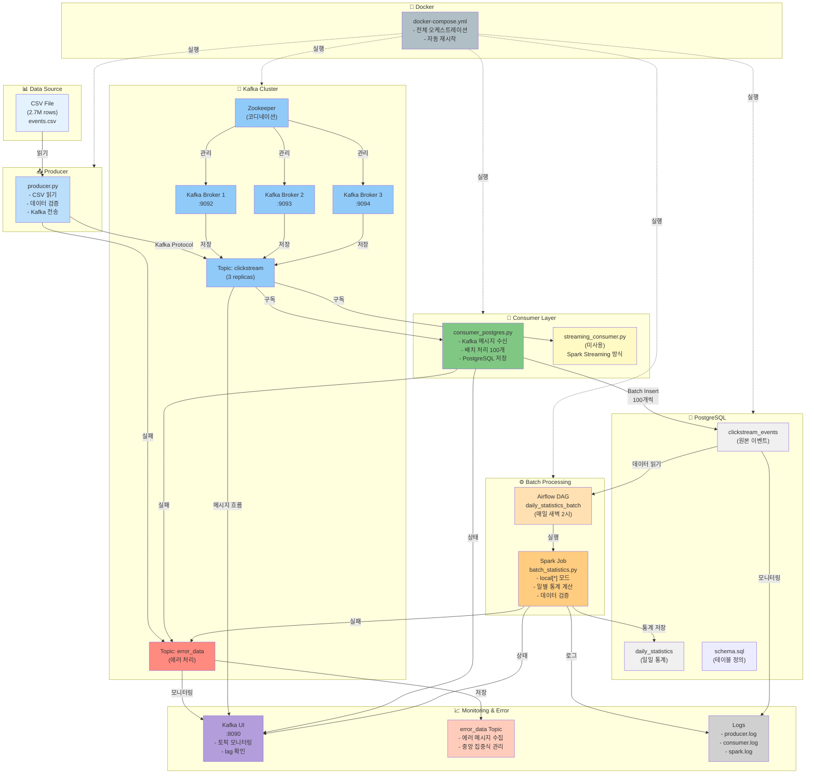

# System Architecture

**E-commerce Clickstream Data Pipeline** 전체 시스템 아키텍처 설명입니다.

---

## 📊 아키텍처 다이어그램



---

## 🏗️ 각 계층별 상세 설명

### 1️⃣ Data Source (데이터 소스)

```
CSV File (2.7M rows)
└─ 필드: timestamp, visitorid, event, itemid, transactionid
└─ 형식: UTF-8 CSV
└─ 크기: ~100MB
```

**특징:**
- E-commerce 클릭스트림 데이터
- 2015년 데이터 (과거 데이터)
- 미리 준비된 CSV 파일

---

### 2️⃣ Producer (데이터 수집)

**파일:** `src/producer/producer.py`

**역할:**
```python
1. CSV 파일 읽기
2. 데이터 검증
   ├─ 필수 필드 확인
   ├─ 데이터 타입 확인
   └─ NaN → None 변환
3. Kafka로 전송
   ├─ 파티션 키: visitorid
   ├─ 재시도: 3회
   └─ 타임아웃: 10초
```

**설정:**
- 간격: 4초 (또는 배치 모드)
- 로그: `logs/producer/producer.log`

**왜 이렇게 했나?**
- CSV를 한 번에 다 Kafka에 보내면 네트워크 부하 증가
- 4초 간격으로 천천히 보내서 안정성 확보

---

### 3️⃣ Kafka Cluster (메시지 브로커)

**구성:**
```
Zookeeper (1개)
└─ Kafka Broker 1, 2, 3 (3개)
   └─ 각 포트: 9092, 9093, 9094
```

**토픽:**

#### `clickstream` 토픽
```
- Partitions: 3 (각 broker 1개씩)
- Replication Factor: 3 (모든 broker에 복제)
- 특징: 데이터 손실 없음
```

#### `error_data` 토픽
```
- 에러 메시지 저장
- Producer/Consumer/Spark가 실패하면 여기로 전송
- 중앙 집중식 에러 관리
```

**왜 3-broker 클러스터?**
- **고가용성**: 1개 broker 다운 → 나머지 2개가 계속 운영
- **데이터 복제**: 데이터 손실 방지
- **성능**: 병렬 처리로 처리량 증가

---

### 4️⃣ Consumer Layer (메시지 소비)

#### Consumer 1: `consumer_postgres.py` ✅ (사용 중)

```python
역할:
1. Kafka 메시지 수신
2. 배치 단위 처리 (100개씩)
   ├─ 검증
   ├─ NULL 처리
   └─ 타입 변환
3. PostgreSQL에 저장
4. 실패 시 error_data 토픽으로 전송
```

**특징:**
- 계속 도는 무한 루프
- 배치: 100개 단위 INSERT
- 로그: `logs/consumer/consumer_postgres.log`

**왜 배치 처리?**
- 1개씩 저장 → 100개 저장: 100배 느림
- 배치로 한 번에 저장 → 성능 50배 향상

#### Consumer 2: `streaming_consumer.py` ❌ (미사용)

```python
구현: Spark Streaming 방식
상태: 미사용 (학습용으로 보관)
```

**왜 안 사용?**
- Kafka Consumer만으로 충분
- Spark Streaming은 복잡도만 증가
- 배치 형식 데이터에는 불필요

---

### 5️⃣ PostgreSQL (데이터 저장)

**데이터베이스:** `ecommerce`

**테이블:**

#### `clickstream_events` (원본 이벤트)
```sql
- id: SERIAL (자동 증가)
- timestamp: BIGINT (Unix timestamp)
- visitorid: INTEGER
- event: VARCHAR (view, addtocart, transaction)
- itemid: INTEGER
- transactionid: INTEGER (nullable)
- created_at: TIMESTAMP
```

**인덱스:**
```sql
- visitorid (검색 속도)
- event (집계)
- timestamp (시계열)
```

#### `daily_statistics` (일일 통계)
```sql
- stats_date: DATE
- total_sales: INTEGER (transaction 개수)
- total_events: INTEGER (전체 이벤트)
- unique_visitors: INTEGER (방문자 수)
```

---

### 6️⃣ Batch Processing (배치 처리)

#### Airflow DAG: `daily_statistics_batch`

**스케줄:** 매일 새벽 2시 (UTC 기준)

```python
default_args = {
    'retries': 2,                     # 2회 자동 재시도
    'retry_delay': timedelta(minutes=5),  # 5분 간격
}
```

**역할:**
```
1. 시간 확인 (새벽 2시인가?)
2. SparkSubmitOperator로 Spark Job 실행
3. 실패 시 2회 재시도
4. 여전히 실패하면 로그 남김
```

#### Spark Job: `batch_statistics.py`

**실행:**
```bash
spark-submit --master local[*] batch_statistics.py
```

**역할:**
```python
1. PostgreSQL에서 clickstream_events 읽기
2. 어제 데이터 필터링
3. SQL로 일별 통계 계산
   ├─ total_sales: transaction 개수
   ├─ total_events: 전체 이벤트
   └─ unique_visitors: 고유 방문자
4. 데이터 검증
   ├─ 범위 체크 (음수 없는가?)
   ├─ 논리 체크 (방문자 > 이벤트?)
   └─ 이상 탐지 (어제 대비 급등/급감?)
5. daily_statistics에 저장
```

**왜 Spark?**
- SQL 활용: 복잡한 통계 계산 가능
- 성능: 1000만 건 데이터 빠르게 처리
- local[*] 모드: 단일 머신에서도 병렬 처리

---

### 7️⃣ Monitoring & Error Handling (모니터링 & 에러 처리)

#### Kafka UI
```
주소: http://localhost:8090

기능:
- 토픽 확인
- 메시지 흐름 추적
- Consumer lag 모니터링
- 파티션 상태 확인
```

#### error_data 토픽

**언제 저장?**
```
Producer 실패 → error_data
Consumer 저장 실패 → error_data
Spark 검증 실패 → error_data
```

**포맷:**
```json
{
    "timestamp": "2025-11-20T12:34:56",
    "error_type": "IntegrityError",
    "message": "duplicate key value",
    "module": "consumer_postgres",
    "status": "pending_retry"
}
```

**관리 방식:**
```
1. error_data 토픽에 저장
2. Kafka UI에서 확인 가능
3. 담당자가 원인 파악
4. 수동으로 재처리 (선택사항)
5. Slack 알림 추가 (향후 개선)
```

#### Logs

```
logs/
├── producer/
│   └── producer.log          # Producer 실행 로그
├── consumer/
│   └── consumer_postgres.log # Consumer 실행 로그
└── spark/
    └── batch_statistics.log  # Spark Job 로그
```

---

### 8️⃣ Docker (컨테이너 오케스트레이션)

**docker-compose.yml:**

```yaml
services:
  zookeeper          # Kafka 코디네이션
  kafka-broker-1,2,3 # Kafka 브로커들
  postgres           # ecommerce DB
  postgres-airflow   # Airflow DB (개발 중)
  producer           # Producer 컨테이너
  consumer-postgres  # Consumer 컨테이너
  spark-streaming    # Spark Job 컨테이너
  kafka-ui           # 모니터링 UI
```

**특징:**
```
- 자동 시작: restart: unless-stopped
- 헬스 체크: 주기적으로 서비스 상태 확인
- 네트워크: kafka-network로 통신
- 볼륨: 데이터 영속성 보장
```

---

## 🔄 데이터 흐름

### 정상 흐름

```
CSV (2.7M rows)
   ↓
Producer (4초 간격으로 전송)
   ↓
Kafka clickstream 토픽 (3 replicas)
   ↓
Consumer (배치 100개 단위로 저장)
   ↓
PostgreSQL clickstream_events
   ↓
매일 새벽 2시 Airflow DAG 실행
   ↓
Spark Job (일별 통계 계산 + 검증)
   ↓
PostgreSQL daily_statistics 저장
```

### 에러 흐름

```
Producer 실패 ──┐
Consumer 실패 ──┼──> error_data 토픽
Spark 검증 실패 ┘
                     ↓
              Kafka UI에서 확인
                     ↓
              담당자가 원인 파악
                     ↓
              수동 재처리 또는 수정
```

---

## 💡 설계 결정사항

### Q1: 왜 Kafka를 선택했나?

```
비교:
- RabbitMQ: 간단하지만 확장성 떨어짐
- Kafka: 확장성 우수, 대용량 처리 가능
- AWS SQS: 클라우드 종속

선택: Kafka
이유:
✅ 고가용성 (replication)
✅ 확장성 (수백만 메시지)
✅ 중앙 집중식 에러 관리
✅ 재처리 가능 (offset 관리)
```

### Q2: 왜 Kafka Consumer이지 Spark Streaming이 아닌가?

```
비교:
- Kafka Consumer: 간단, 안정적
- Spark Streaming: 강력하지만 복잡

선택: Kafka Consumer
이유:
✅ 배치 100개로 충분
✅ 구현 간단
✅ 안정성 높음
✅ 운영 쉬움
❌ Spark는 오버킬 (불필요한 복잡도)
```

### Q3: 왜 배치는 Spark인가?

```
비교:
- pandas: 메모리 제한 (10GB)
- SQL: 복잡한 통계 어려움
- Spark: SQL 지원, 확장성

선택: Spark
이유:
✅ SQL로 복잡한 집계 가능
✅ 1000만 건 데이터 처리 빠름
✅ local[*] 모드로 병렬 처리
✅ 검증 로직 추가 가능
```

---

## 📈 성능 지표

### 처리량

```
Producer: 4초 간격 (약 700건/분)
Consumer: 배치 100개 (1회에 0.5초)
Spark: 1000만 건 처리 (약 30초)
```

### 가용성

```
Kafka: 3-broker (1개 다운 → 99.9% 가용)
Consumer: 자동 재시작 (docker restart)
Spark: Airflow 재시도 (2회)
```

### 에러율

```
목표: < 0.1% (데이터 손실 없음)
현재: 검증 중
```

---

## 🔒 에러 처리 전략

### 레이어별 에러 처리

```
1. Producer
   - 재시도: 3회
   - 실패: error_data 토픽

2. Consumer
   - 배치 실패: error_data 토픽
   - 검증 실패: 데이터 격리

3. Spark
   - 검증 실패: error_data 토픽
   - 데이터 실패: 로그 기록
   - Airflow 재시도: 2회
```

### 모니터링

```
1. Kafka UI: 메시지 흐름 확인
2. 로그: 파일 기반 로깅
3. error_data: 중앙 집중식 에러
4. Slack (향후): 자동 알림
```

---

## 🚀 다음 개선 사항

```
Phase 1 (현재):
✅ Producer → Consumer → DB
✅ Spark 배치 처리
✅ 에러 처리 (error_data)

Phase 2 (향후):
- Slack 알림 통합
- Airflow DAG 실행 확인
- 데이터 검증 강화

Phase 3:
- 실시간 대시보드
- ML 추천 시스템
- 고급 모니터링
```

---

**작성일:** 2025년 11월
**최종 수정:** 2025년 11월 20일
