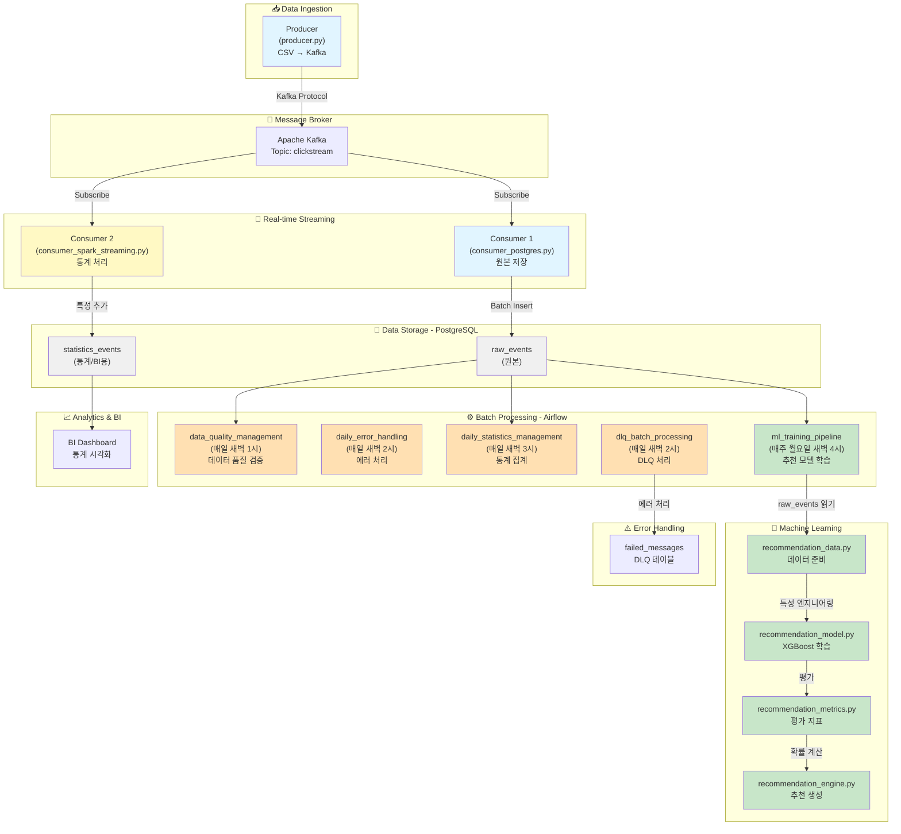
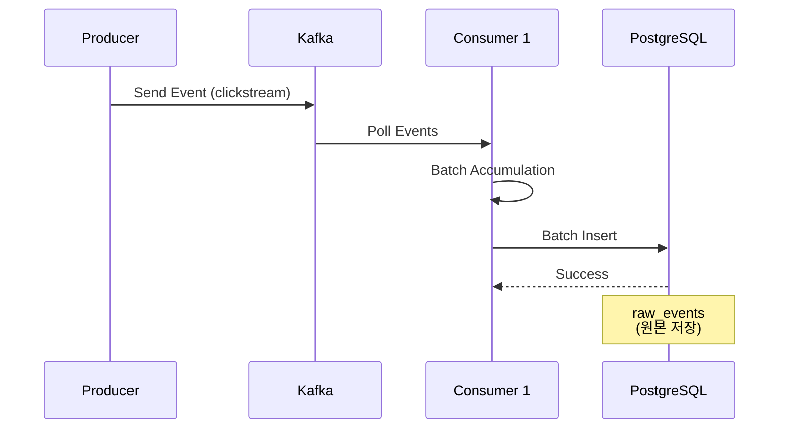
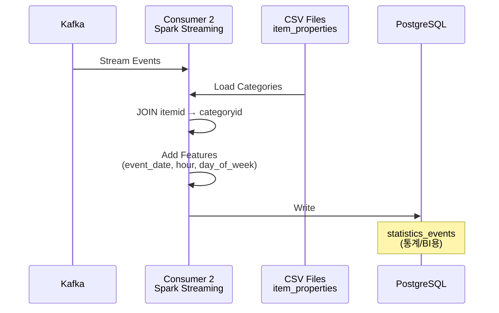
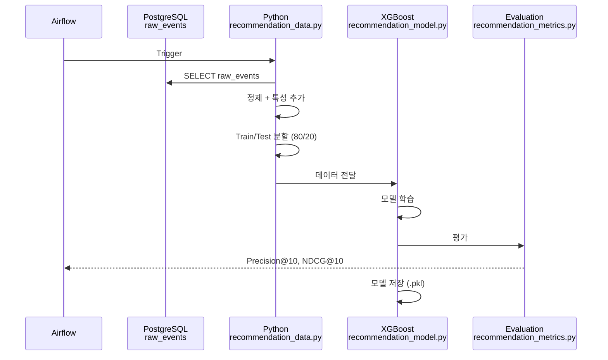
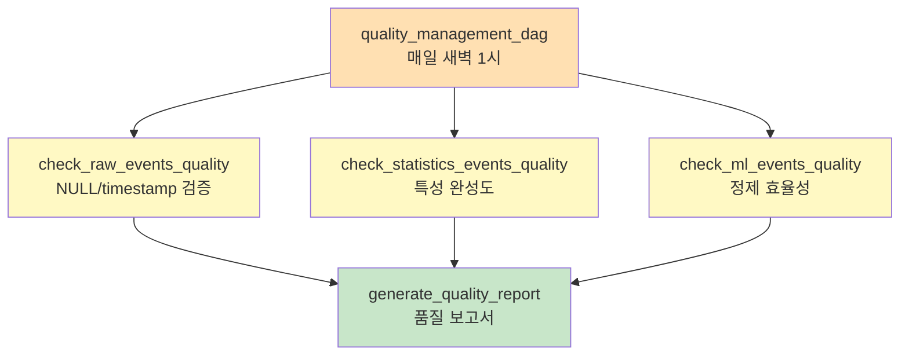
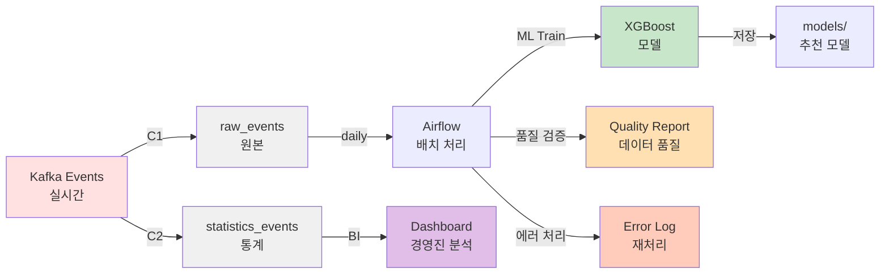

# E-commerce Data Pipeline Architecture

## 📊 전체 아키텍처



---

## 🔄 데이터 플로우

### 1️⃣ 실시간 데이터 수집 (Consumer 1)



### 2️⃣ 실시간 통계 처리 (Consumer 2 - Spark Streaming)



### 3️⃣ 배치 ML 학습 (Airflow - 주 1회)



### 4️⃣ 데이터 품질 검증 (Airflow - 매일)



---

## 📋 주요 컴포넌트

### Consumer 1 (Python - 동기식)
- **파일**: `src/consumer/consumer_postgres.py`
- **역할**: 원본 데이터 저장
- **특징**:
  - 실시간 메시지 구독
  - 배치 삽입 (100건씩)
  - 에러 추적
- **저장 테이블**: `raw_events` (원본 그대로)

### Consumer 2 (Spark Streaming - 비동기식)
- **파일**: `src/consumer/consumer_spark_streaming.py`
- **역할**: 통계용 데이터 처리
- **특징**:
  - Kafka 스트림 읽기 (최신 오프셋)
  - item_properties와 JOIN
  - 시간 특성 추가 (hour, day_of_week, date)
  - Primary Key 생성 (MD5 해시)
- **저장 테이블**: `statistics_events` (통계/BI용)

### ML 파이프라인 (Airflow - 주 1회)
- **DAG**: `ml_training_pipeline.py` (매주 월도일 새벽 4시)
- **모듈**:
  1. `recommendation_data.py`: 데이터 준비 (정제 + 특성)
  2. `recommendation_model.py`: XGBoost 학습
  3. `recommendation_metrics.py`: 평가 (Precision@10, NDCG@10)
  4. `recommendation_engine.py`: 추천 생성
- **평가 방식**: 오프라인 (과거 데이터로 검증)

### Airflow DAGs

#### 1. data_quality_management (매일 새벽 1시)
- raw_events 품질 검증
- statistics_events 특성 완성도
- ml_prepared_events 정제 효율성

#### 2. daily_error_handling (매일 새벽 2시)
- 에러 로그 수집
- 에러 분류 및 분석
- 자동 재처리

#### 3. daily_statistics_management (매일 새벽 3시)
- 사용자 통계 계산
- 상품 통계 계산
- 매출 통계 계산
- 전환율 분석

#### 4. ml_training_pipeline (매주 월요일 새벽 4시)
- raw_events 읽기
- 정제 + 특성 추가
- 모델 학습
- 평가 + 특성 중요도

#### 5. dlq_batch_processing (매일 새벽 2시)
- 실패 메시지 수집
- 에러 분석
- 자동 재처리

---

## 📊 데이터 테이블 구조

### raw_events (Consumer 1에서 저장)
```
id (BIGINT PK)
├─ timestamp (BIGINT) - Unix milliseconds
├─ visitorid (INTEGER)
├─ event (VARCHAR) - view, click, purchase
├─ itemid (INTEGER)
├─ transactionid (INTEGER)
└─ created_at (TIMESTAMP)
```

### statistics_events (Consumer 2에서 저장)
```
id (BIGINT PK)
├─ timestamp, visitorid, itemid, categoryid
├─ event, transactionid
├─ event_date (YYYY-MM-DD)
├─ hour_of_day (0-23)
├─ day_of_week (1-7)
├─ is_purchase (0/1)
└─ created_at (TIMESTAMP)
```

### ML 학습 데이터 (Python 메모리에서 처리)
```
Source: raw_events (PostgreSQL)
  ↓
정제: NULL 제거, timestamp 유효성
  ↓
특성: event_hour, event_dow, event_month, ...
  ↓
분할: Train 80% / Test 20% (시간순)
  ↓
학습: XGBoost (구매 확률 예측)
  ↓
평가: Precision@10, NDCG@10
```

---

## 🔄 아키텍처 흐름 요약



---

## ⏰ 스케줄

```
00:00 ─ [idle]
01:00 ─ data_quality_management (품질 검증)
02:00 ─ dlq_batch_processing (에러 처리)
02:00 ─ daily_error_handling (에러 분석)
03:00 ─ daily_statistics_management (통계 집계)
04:00 ─ ml_training_pipeline (ML 학습) [월요일만]
```

---

## 📈 성능 지표

### Consumer 1 (Python)
- 배치 크기: 100건
- 처리 속도: ~1000 msg/sec

### Consumer 2 (Spark Streaming)
- 배치 크기: 10,000건/trigger
- 처리 속도: ~100,000 msg/sec (분산 처리)

### ML 모델
- 학습 데이터: raw_events 전체
- 평가: Precision@10, NDCG@10
- 목표: Precision@10 > 0.25, NDCG@10 > 0.5

---

## 🔐 데이터 보안

### Error Handling
- 실패 메시지: `logs/failed_messages/YYYY-MM-DD.jsonl`
- DLQ 테이블: `failed_messages`
- 재처리: 자동 + 수동 검토

### Data Quality
- 원본 보존: `raw_events` (모든 데이터)
- 통계 기반: `statistics_events` (정제된 특성)
- ML 학습: Python 메모리 (추가 정제)

---

## 🚀 확장성

### 수평 확장
- **Producer**: 여러 인스턴스 실행 가능
- **Consumer 1**: Consumer Group으로 파티션 분배
- **Consumer 2**: Spark 클러스터 모드

### 향후 개선
1. 실시간 추천 API 제공 (recommendation_engine)
2. 온라인 평가 (A/B 테스트)
3. ML 모델 자동 갱신
4. 상품 추천 배치 처리 (권장 상품 사전 계산)
